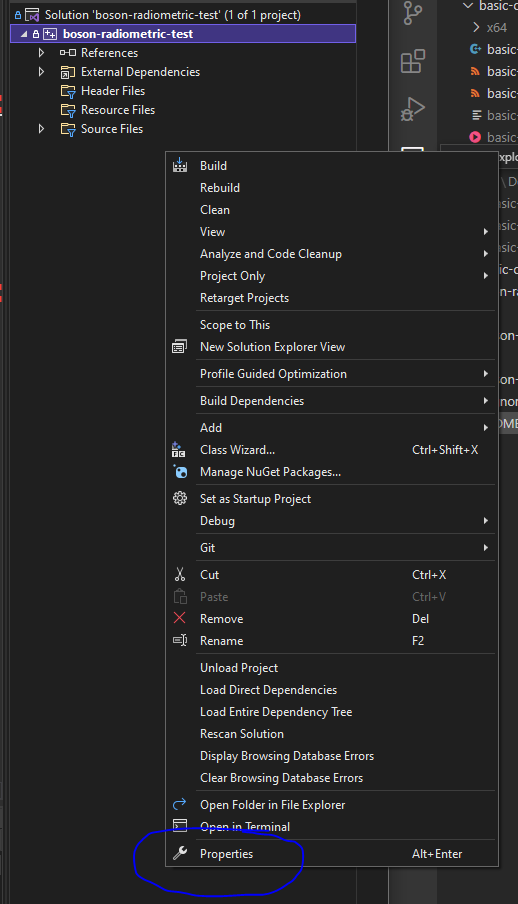
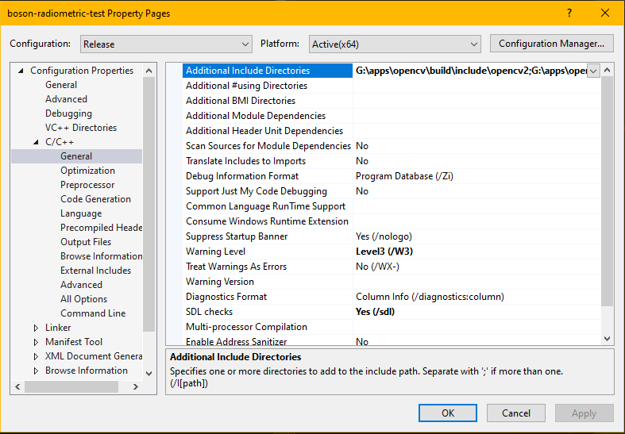
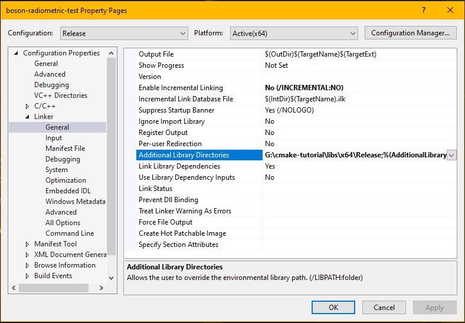
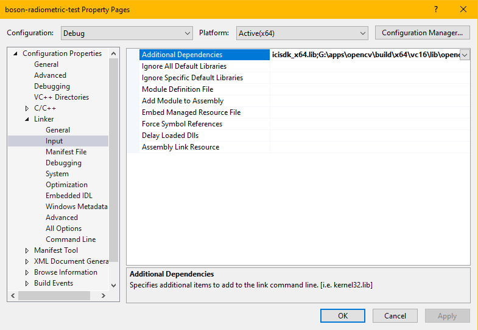

# Boson Camera Tests
Each directory contains a project dealing with the Flir Boson IR camera. Some directories do not compile, because we are still trying to figure out how to link the SDKs needed to run them.

# How to Link and Build
## OpenCV

OpenCV can be downloaded for free from [https://opencv.org/releases/](https://opencv.org/releases/)

1. Open the project properties. Make sure the project is selected as shown below in order to bring up the correct properties dialog box.



I have found that the configuration that is selected does not really matter too much as long as it is the same configuration used throughout and also the one that is currently being used for the program. I typically stick with Debug since that seems to be somewhat of a default.

2. Select **C/C++** then **General**. 


The picture above highlights the *Additional Include Directories* where the next two lines need to be added. The path will be different depending on where OpenCV is downloaded on your computer.

``` 
G:\apps\opencv\build\include\opencv2
G:\apps\opencv\build\include 
```

3. Select **Linker** and then **General**.



Add the two lines below to the *Additional Library Directories* section. This path may be different depending on the location where OpenCV was downloaded and the version.

```
G:\apps\opencv\build\x64\vc16\lib
G:\apps\opencv\build\x64\vc16\bin
```

4. Select **Input** under Linker.



Add the following line in the *Additional Dependencies* section.

```
G:\apps\opencv\build\x64\vc16\lib\opencv_world470d.lib
```

5. Include the directory in your code.
```
#include "opencv2/opencv.hpp"
```


## ICI SDK

These steps are in the same order as the ones above and in the same places.

1. Add the **C/C++ > General** *Additional Include Directories*

```
G:\FlirBosonCalibration_UCF_20221219\FlirBosonCalibration
```


2. Add the **Linker > General** *Additional Library Directories*

```
G:\cmake-tutorial\libs\x64\Release
```


3. Add the **Linker > Input** *Addtional Dependancies*

```
icisdk_x64.lib
```


## Boson SDK (?????)

The Boson SDK can be downloaded from [https://www.flir.com/support/products/boson/#Downloads](https://www.flir.com/support/products/boson/#Downloads)
